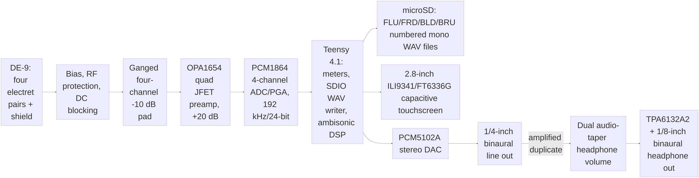

# Hardware architecture

## Throughput budget

Four packed 24-bit channels at 192 kHz require 18.432 Mbit/s, or 2.304 MB/s,
before filesystem overhead. Storing 32-bit words for DMA alignment increases
the internal/write-side stream to 3.072 MB/s. The Teensy 4.1 native SDIO port
has ample interface bandwidth, but the firmware must use large aligned buffers,
preallocation, and a qualified microSD card to avoid write-latency dropouts.

## Gain budget

The OPA1654 stage provides 20.1 dB. The PCM1864 PGA is set identically on all
four channels from -12 dB to +32 dB, producing 8 dB to 52 dB total gain. The
single encoder is digital, which avoids the tracking mismatch of a four-gang
analog potentiometer. The -10 dB pad shifts the effective range to -2 dB to
42 dB when enabled.

## Clock and data partition

- ADC: 192 kHz on two I2S data lines (PCM1864 DOUT + DOUT2 into Teensy SAI1
  quad input, 12.288 MHz BCK per line); single-line 256-BCK TDM is only
  viable at 96 kHz and remains the fallback mode.
- Monitor DSP: decimate to 48 kHz, apply calibrated tetrahedral decode and
  binaural FIR filters, then limit before DAC output.
- DAC: independent 48 kHz stereo I2S transmitter.
- Display/touch: SPI, updated below audio/SD interrupt priority.
- Control: I2C for PCM1864 registers; GPIO for record, pad sense, encoder, and
  headphone-amplifier enable.

## Grounding and shielding

The DE-9 metal shell and pin 5 are `CHASSIS`. They bond directly to the metal
enclosure at the connector. `CHASSIS` couples to circuit ground through a
parallel 1 nF capacitor and 1 MOhm bleed resistor, with an optional 0 Ohm link
for EMC testing. Capsule returns are not tied to the cable jacket in the cable;
they join the quiet analog ground region on the PCB.

The two-layer layout uses a nearly continuous bottom ground plane. Switching
power, Teensy, display, and SD currents stay away from the input/preamp corner.
The ADC bridges the analog and digital placement regions without splitting its
ground reference plane.

The PCM1864 is the only variable-gain element. This is intentional: one encoder
changes a common digital register value, so the four channels do not suffer the
tracking error of a four-gang analog potentiometer.
